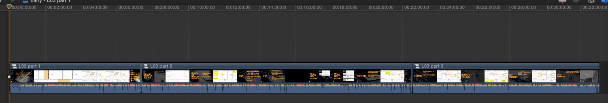

# Ashley's LEAP Content Production Editing Notes

### Tues May 3rd 2016
_Began at about 11:45 AM PST._

# Project setup

- Received Dropbox folder invitation from Alex with Slides and Audio;
    + `\Audio\LEAP - Session 2-5.aiff`
    + `\Audio\LEP - Lesson 2-6 Edited.aiff`
    + `\Audio\LEP - Lesson 2-7 Edited.aiff`
    + `\Slides\LEAP - Lesson 5.key`
    + `\Slides\LEAP - Lesson 6.key`
    + `\Slides\LEAP - Lesson 7.key`
    + `\Slides\LEAP - Lesson 8.key`
    + `\Slides\LEP - Lesson 5.key`
    + `\Slides\LEP - Lesson 6.key`
    + `\Slides\LEP - Lesson 7.key`
    + `\Slides\LEP - Lesson 9.key`
- First impression; files are confusingly named, had to clarify with Alex that "LEAP" versions of Slides are most up-to-date, still missing Alex' Lesson 9 updated Keynote deck, don't yet have Hussein's Lesson 8 or Lesson 9 audio files. (Not aligned with Alex' self-impoosed deadlines from our contract.)

# Lesson 5 preliminary edit

- Reviewed `\Slides\LEAP - Lesson 5.key` – found 15-20 slides with lots of text on them (30-60 words per slide) and reached out to Alex on Slack, apparently he's OK with this early-stage version; mentioned that the edit might go faster becasuse of having fewer edits to align etc.
- Connected 120GB USB HDD and 240GB Thunderbolt SSD, began copying `~ Completed Edited, Master Files, and Uploads` from SSD to HDD as backup of "finished" content on SSD.
- Opened up FCPX, reviewed project files and assets.
- Reviewed filenames on SSD as well; Created new folder called `May 2016 - LEAP Lesson 5` for the new Lesson 5 edit; renamed previous folders (for Lesson 1 through 4) as `Early - LEAP Lesson 1` and so on.
- Tidied and organized files and folders on SSD; now all exported slide decks are in `exported deck` subfolders.
- Opened `SSD\May 2016 - LEAP Lesson 5\`, renamed `LEAP - Session 2-5.aiff` to `LEAP - Lesson 2.aiff`.
- Opened `LEAP - Lesson 5.key` in Keynote; total of 64 slides.
- Exported Lesson 5 keynote deck to `.\exported deck\` with these settings:


- Export completed: 64 slides total.
- Renamed previous Projects in FCPX library as `Early - x` where `x` is the previous (early 2016) project name.
-  Created a new Project called `May 2016 - L05` for the (whole Episode 5) edit, see here:


- Began edit by importing `exported deck` images and `LEAP - Lesson 5.aiff` audio file.
- Dragged audio file to timeline as timing anchor; I have assumed that this is the master "pace" of the edit.
- Copied (Early Lesson 5) intro video (from boardroom / Hussein on camera introducing the Lesson) into new Lesson 5 project timeline.

### Edited/assembled Lesson 5 preliminary edit. Runtime 19m50s.


- Some sections of Hussein's audio don't yet have accompanying slides, have left them blank for now; will follow up with Alex on these missing slides (or ask to make decisions about removing Hussein's additional content, etc) once the preview is available for his review.
- Rendered 540p preview copy of entire Lesson 5 edit via Compressor, shared in [#lep_content](https://launchacademy.slack.com/messages/lep_content/) channel on the [Launch Academy Slack](http://launchacademy.slack.com/) board. (Will take a while to upload the ~238MB video file.)
- Consolidated preview video into project folder on SSD.

_Went off the clock at about 1:25 PM PST._

---

_Resumed working on project at about 7:45 PM PST._

# Lesson 6 early edit

- Duplicated `May 2016 - L05` and renamed to `May 2016 - L06` in FCPX.
- Cleared out duplicated timeline, other than introductory slide.
- Opened `SSD\` to create `May 2016 - LEAP Lesson 6\` folder and copy in assets from Dropbox shared folder.
- Copied in files, renamed to convention established with Lesosn 5 folder / file setup.
- Opened Lesson 6 keynote file to review deck; 53 frames total.
- Exported all keynote slides to `exported deck` folder to follow convention; resulted in 53 frames total output.
- As before, dragged Hussein's audio file into FCPX project space and onto L06 timeline, assuming this is the "master" pace of the edit.
- Added in L05 intro content (front boardroom / Hussein on camera.)

### Edited/assembled Lesson 6 preliminary edit. Runtime: 21m12s.


- A few missing slides and extra audio; massive production value-adds available through mini animations, edits, pacing, etc.
- Rendered 540p preview copy of entire Lesson 6 edit via Compressor, shared in [#lep_content](https://launchacademy.slack.com/messages/lep_content/) channel on the [Launch Academy Slack](http://launchacademy.slack.com/) board. (Will take a while to upload the ~279MB video file.)
- Consolidated preview video into project folder on SSD.
- Alex updated the Lesson 5 and Lesson 6 keynote decks in Dropbox; will have to update him on the workflow for integrating those changes.

_Went off the clock at about 8:45 PM PST._

---

### Weds May 4th 2016
_Began at about 1:20 PM PST._

# Lesson 7 early edit

- Duplicated `May 2016 - L05` and renamed to `May 2016 - L06` in FCPX.
- Cleared out duplicated timeline, other than introductory slide.
- Opened `SSD\` to create `May 2016 - LEAP Lesson 7\` folder and copy in assets from Dropbox shared folder.
- Copied in files, renamed to follow convention.
- Opened Lesson 7 keynote file to review deck; 21 slides shown.
- Exported all keynote slides into `exported deck` folder to follow convention; resulted in 30 individual build frames as total output.
- Added Hussein's audio file into FCPX project space and onto L07 timeline, assuming this is the "master" pace of the edit.
- Added in L06 intro content (front boardroom / Hussein on camera.)

### Edited/assembled Lesson 7 preliminary edit. Runtime: 18m27s.


- A few missing slides again, lots of room for more granular slide builds and improvements; additional logos from companies mentioned, etc.
- Hussein added a lot in audio to several slides; might be good for Alex to review slide content and/or update as necessary.
- Rendered 540p preview copy of entire Lesson 7 edit via Compressor, shared in [#lep_content](https://launchacademy.slack.com/messages/lep_content/) channel on the [Launch Academy Slack](http://launchacademy.slack.com/) board.
- Consolidated preview video into project folder on SSD.
- Notified team on Slack and requested review.

_Went off the clock at about 2:12 PM PST._

---

### Sun May 8th 2016
_Began at about 6:20 PM PST._

# Lesson 5-6-7 edit updates

- Caught up on Alex' feedback notes via Slack:

```
----- May 4th -----
alexchuang72 [5:01] 
so I just finished reviewing lesson 5, looks great so far

[5:02] 
for the black screens, i would just use the previous slide

[5:02] 
don’t think they would need additional verbose slides

[5:06] 
oh it seems like session 5 intro was used for session 6


----- May 5th -----
alexchuang72 [2:47 PM] 
session 6 looks good as well besides the intro part

[2:47] 
please use previous slides for the black screens

alexchuang72 [9:02 PM] 
just reviewed lesson 7

[9:04] 
can we start the“What is a MVP” slide at 1:15

[9:04] 
and i think we’ll need to add additional recording from Hussein to talk about the homework at the end

[9:05] 
but everything else looks good!
```

- Opened FCPX project space.
- **Lesson 5 opened.**
- Resized slide `5.032` starting at `08:37:04` from `08:49:18` to `09:03:18` to fill up blank space.
- Resized slide `5.036` starting at `09:30:25` from `09:59:20` to `10:12:08` to fill up blank space.
- Resized slide `5.038` starting at `10:37:25` from `10:57:16` to `11:16:06` to fill up blank space.
- Resized slide `5.043` starting at `12:14:20` from `12:37:07` to `12:53:22` to fill up blank space.
- Resized slide `5.054` starting at `16:30:05` from `16:50:22` to `17:03:23` to fill up blank space.
- Resized slide `5.058` starting at `17:39:21` from `18:20:14` to `18:25:25` to fill up blank space.
- Resized slide `5.062` starting at `18:55:24` from `19:10:22` to `19:27:04` to fill up blank space.
- Reviewed edit and added cross dissolve transitions between slides.
- Episode 5 edit is now `19:44:25` long.
- Rendered all transitions to timeline.
- Sent preview copy to Compressor with same (Large 540p) settings as previous preview outputs.
- Moved preview video onto SSD, renamed to follow previous convention, i.e. `Lesson 05 Preview 2.mov` for now.
- Shared `Lesson 05 Preview 2.mov` on the [#lep_content](https://launchacademy.slack.com/messages/lep_content/) channel on the [Launch Academy Slack](http://launchacademy.slack.com/) board.

_Went off the clock at about 6:50 PM PST._

---

_Resumed working on project at about 8:15 PM PST._

- Copied split section of Lesson 5 into `May 2016 - L05 Part 1` Project in FCPX.
- Shared to Compressor, to prepare H.264 compressed copy, ready for Thinkific upload.


- Created Compressor preset called "HD1080p for Thinkific" and exported a Compressor droplet (converstion app with preset built in) onto the SSD.
- Compressor settings for Thinkific preparation are as follows:


- Began Compressor batch job with Lesson 5 Part 1.
- Returned to FCPX to resume episode module creation.
- Split Lesson 5 Part 2 and 3 into respective Projects; sent both to Compressor with same preset as above.
- Compressor now working in Batch mode; has all 3 Parts to complete.
- Resumed editing in FCPX in the mean time, as per Alex' feedback and notes.
- **Lesson 6 opened.**
- Replaced broken introduction video (front boardroom / Hussein shown on screen) with correct Lesson 6 introduction, edited timing to hide trailing intro and outro.
- Resized slide `6.004` starting at `01:07:21` from `01:17:21` to `01:27:15` to fill up blank space.
- Resized slide `6.007` starting at `02:39:21` from `02:54:20` to `03:05:23` to fill up blank space.
- Compressor finished, moved transcoded output video files onto SSD under the `~ Completed Edited, Master Files, and Uploads` folder.
- Resumed editing Lesson 6 in FCPX.
- Resized slide `6.026` starting at `09:53:04` from `10:01:26` to `10:17:28` to fill up blank space.
- Resized slide `6.028` starting at `10:37:29` from `11:00:29` to `11:10:06` to fill up blank space.
- Resized slide `6.030` starting at `11:35:19` from `11:46:06` to `12:12:04` to fill up blank space.
- Resized slide `6.047` starting at `17:19:26` from `17:25:08` to `17:31:23` to fill up blank space.
- Resized slide `6.050` starting at `17:54:07` from `18:07:15` to `18:25:21` to fill up blank space.
- Reviewed edit and added cross dissolve transitions between slides.
- Copied L06 Part 1 into new Project, sent timeline from that segment to Compressor with previous settings.
- Copied L06 Part 2 into new Project, sent timeline from that segment to Compressor with previous settings.
- Ran Compressor batch, has 2 Parts to complete.
- **Lesson 7 opened.**
- Resized slide `7.006` starting at `01:45:09` from `02:01:18` to `02:02:22` to fill up blank space.
- Resized slide `7.008` starting at `02:02:22` from `02:17:05` to `02:25:06` to fill up blank space.
- As per Alex' request, moved "What is an MVP?" slide (number `7.004`) to `01:14:18` and resized previous slide (`7.003`) to fill up blank space.
- Created break/cut in long Lesson 7 edit at the "High Fidelity Tests" introduction slide; Lesson is now available to split into two modules/parts.
- Reviewed edit and added cross dissolve transitions between slides.
- Copied L07 Part 1 into new Project, sent timeline from that segment to Compressor with previous settings.
- Copied L07 Part 2 into new Project, sent timeline from that segment to Compressor with previous settings.
- Ran Compressor batch, has 2 Parts to complete.
- Moved transcoded output video files for L06 Part 1 + 2 onto SSD.
- Compressor completed, moved transcoded output video files for L07 Part 1 + 2 onto SSD.
- Reviewed output video files on SSD; everything is looking great. 
- Need to confer with Alex about next steps in edit, signing off for now.

_Went off the clock at about 9:26 PM PST._

---

### Mon May 9th 2016
_Began at about 9:55 AM PST._

# Lesson 5-6-7 Delivery

- Alex has requested that I deliver the output video files via Dropbox; copying from SSD to local Dropbox folder and allowing Dropbox to perform deliver/sync.
- Dropbox has to sync 2.354GB of content for this delivery, will take several hours, but will work in the background.

_Went off the clock at about 10:00 AM PST._

---

### Thurs May 12th 2016
_Began at about 3:48 PM PST._

- Resumed project on Lesson 8 & 9 slide deck review in preparation for edit.
- Created `May 2016 - LEAP Lesson 8` folder on `SSD/` and copied Keynote file and AIFF audio file from ALex' shared Dropbox folder.
- Renamed audio file to fit with previous convention.
- Opened FCPX and created `May 2016 - L08` Project.
- Opened Keynote deck, reviewed slides: 33 slides total, upon export, resulted in 33 .PNG image files.
- Copied intro slide into `L08` Project and discovered a problem; **we do not yet have Lesson 8 or 9 introduction clips**, i.e. Hussein talking to the camera in the Front Boardroom! Notified Alex via Slack immediately.
- Continued with edit. Using the audio file as the "master" for the pace of the edited slides.

### Edited Lesson 8 preliminary edit. Runtime: 18:42:26.

_Paused work momentarily at 4:29 PM._ 

_Resumed work at 4:35 PM._

- Exported preview render (540p) via Compressor.
- Moved preview render file into `SSD\May 2016 - LEAP Lesson 8\May 2016 - L08-preview.mov`
- Chatted with Alex on Slack; arranged video pickup shoot for next Weds at LA.
- Sent L08-preview to Slack channel.
- Continued on with Lesson 9 preliminary edit.
- Created `SSD\May 2016 - LEAP Lesson 9` folder and copied Keynote deck and audio file from Dropbox folder, renamed appropriately.
- Opened Keynote deck, reviewed slide: 59 slides total, upon export, resulted in 62 .PNG image files.
- Began new FCPX Project called `May 2016 - L09` and began with editing.
- Using the audio file as the "master" for the pace of the edited slides.

### Edited Lesson 9 preliminary edit began.

_Paused work momentarily at 5:18 PM._

_Resumed work at 5:24 PM._

_Stopped work at 5:36 PM._

---

### Sat May 14th 2016
_Began at about 10:52 AM PST._

- Resumed Lesson 9 preliminary edit.
- Alex requested improvement to audio take on L09 audio track, noise gate added but reverb tail on Hussein's audio take unavoidable in source material.

### Lesson 9 preliminary edit completed; Runtime: 24:29:12.

- As before, exported preview render (540p) via Compressor.
- Moved preview render file into `SSD\May 2016 - LEAP Lesson 9\May 2016 - L09-preview.mov`
- Sent preview video to #lep_content channel on Slack.

### Resumed review on Early Lesson edits (1 throuth 4) to check continuity and branding.

- Opened L01P01 in FCPX.
- "LEP" branding on first slide, opened and updated to LEAP branding.
- L01P01 review complete, sent to Compressor, rendering in HD1080p for Thinkific upload.
- Opened L01P02 in FCPX.
- Fixed L01P02 LEP branding on first slide.
- L01P02 review complete, sent to Compressor, rendering in HD1080p for Thinkific upload.
- Opened L01P03 in FCPX.
- Fixed LEP branding on first and last slide.
- L01P03 review complete, sent to Compressor, rendering in HD1080p for Thinkific upload.
- Opened L02 in FCPX.
- Fixed LEP branding on last slide.
- L02 review complete.
- Opened separate L02P01 and L02P02 segments, sent to Compressor, rendering in HD1080p for Thinkific upload.
- Opened L03 in FCPX.
- Here's how the multi-part "advanced" early edits look like on the timeline:



- Problems discovered with some of the outro frames in L03P02 and L03P03, just the 'space shuttle' image shown, not the LEAP branding image; had to re-export the L03 Keynote deck to grab these frames.
- L03P01, L03P02, and L03P03 reviewed, sent to Compressor, rendering in HD1080p for Thinkific upload.
- Here's how the batch job looks in Compressor:


- Opened L04 in FCPX.
- L04P01 missing slide cross dissolves; added them in.
- Discovered duplicated and misnamed content, dropped error and realigned; now Lesson 4 spans modules 1 through 7:
	- Understanding the Problem
	- The Five Whys
	- Conducting Problem Interviews
	- Interview Script Breakdown
	- Your Problem Statement
	- Competitive Analysis
	- Vitamins vs Painkillers
- Re-rendered all modules in Lesson 4 via Compressor.
- Completed review on older edited work; updated Alex on Slack.
- Need Alex' feedback on L08 and L09 edits prior to splitting into separate modules and rendering in HD1080p for Thinkific upload.
- Almost ready for delivery!